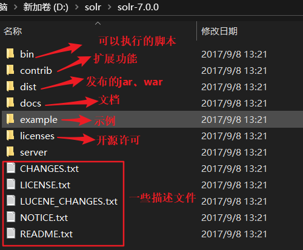
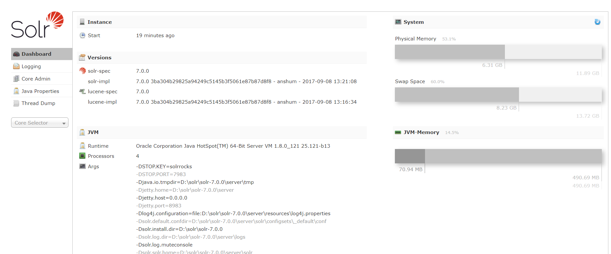

# solr入门


各版本下载地址：<http://archive.apache.org/dist/lucene/solr/>

<br>


## 一、 简介


Apache Solr是一个功能强大的搜索服务器，它支持REST风格API。

**Solr是基于Lucene的**，Lucene 支持强大的匹配能力，如短语，通配符，连接，分组和更多不同的数据类型。

它使用 Apache Zookeeper特别针对高流量进行优化。Apache Solr提供各式各样的功能，下面列出了部分最主要的功能。

- 先进的全文搜索功能。
- XML，JSON和HTTP - 基于开放接口标准。
- 高度可扩展和容错。
- 针对大容量流量进行了优化：
- 同时支持模式和无模式配置。
- 分页搜索和过滤。
- 能够实时索引
- 支持像英语，德语，中国，日本，法国和许多主要语言
- 丰富的文档分析。
- 可拓展的插件架构

<br>

**solr目录结构**：



<br>

**核心概念**

**Document：每个被索引的文档** 

**Field：文档里的各个属性值**

<br>


## 二、 启动solr


**启动solr前，先确认%JAVA_HOME%有没有配置好。**

**solr 的默认端口为：8983**

**启动solr：**

首先要进入到 **bin** 目录下：

```
D:\solr\solr-7.0.0\bin
```

<br>

云启动：

```java
solr -e cloud -noprompt
```

<br>

**单机启动**：

```java
solr start
```

<br>

**重启**：

```
solr restart -p 8983
```

<br>

**关闭**：

```
solr stop -p 8983
```

<br>

打开后，界面如下：



<br>

solr 服务器管理界面可以查看 **系统状态、solr设置、分词检测、查询索引、增减core、查看日志等**

**solr的管理界面可以自行参考这篇文章：[《solr管理界面详解》](https://blog.csdn.net/zcl_love_wx/article/details/52092098)**

<br>

## 建立核心

当Solr的服务器在独立模式下启动的配置称为核心，当它在SolrCloud模式启动的配置称为集合。在这个例子中，我们将有关独立服务器和核心讨论。我们将在以后再讨论SolrCloud。首先，我们需要创建一个核心的索引数据。Solr的创建命令有以下选项：

1. **-c <**name**>** -要创建的核心或集合的名称（必需）。
2. **-d <**confdir**>** -配置目录，在SolrCloud模式非常有用。
3. **-n <**configName**>** -配置名称。这将默认为核心或集合的名称。
4. **-p <**port**>** -本地Solr的实例的端口发送create命令; 默认脚本试图通过寻找运行Solr的实例来检测端口。
5. **-s <**shards**>** -Number of shards to split a collection into, default is 1.
6. **-rf <**replicas**>** -集合中的每个文件的份数。默认值是1。

<br>

**创建一个名为“wenda”的core**

```
solr create -c wenda
```


调用了 **`http://localhost:8983/solr/admin/cores?action=CREATE&name=wenda&instanceDir=wenda**`

这个接口。

```
Creating new core 'wenda' using command:
http://localhost:8983/solr/admin/cores?action=CREATE&name=wenda&instanceDir=wenda

{
  "responseHeader":{
    "status":0,
    "QTime":9399},
  "core":"wenda"}
```

<br>

## 配置文件


创建之后，就可以看到在 **solr安装目录 》 server  》 solr 》** 下有一个 **wenda** 的目录。

在 **wenda 》conf** 目录中有两个配置文件值得我们注意。分别是 **managed-schema** 、**solrconfig.xml** 。


<br>

**managed-schema**:

在文件的117行中有几个定义的字段。我们可以加入自己的检索字段

```
<field name="question_title" type="text_ik" indexed="true" stored="true" multiValued="true"/>
```

**name="question_title"：**建立索引的字段的名称，我们命名为question_title，对问题的标题建立索引。（最好对应数据库的字段名，方便区分）

**type="text_ik"：** 我们分词的类型自定义为 **text_ik**，来表示 **中文分词**。默认是以英文分词，为 **type="text_general"** 。后面我们在定义中文分词器就行。

**indexed="true"** ：是否建立字段索引

 **stored="true"** 索引字段的数据是否 保存

**multiValued="true"**：字段是否有多个值，重复值

<br>

分词分为建立索引时候的分词，查询时候的分词。之所以这样设置的原因是，对于像中文这样的分词比较难，比如“你好中国“，建立索引时，是”你“，”好“，”中“，”国“，”你好“，”中国“，等等拆分。而查询时索引，比如输入”你好“时，并不需要分得这么细。所以，分词的时候，越细越好，查询的时候，就不需要这么细。

英文分词是将空格作为划分，建立和查询是一样的，有自带的标准分词器。

<br>

**第301行**

```
 <fieldType name="text_en" class="solr.TextField" positionIncrementGap="100">
      <analyzer type="index">
       //英文分词时使用默认的分词器：solr.StandardTokenizerFactory
        <tokenizer class="solr.StandardTokenizerFactory"/>
        <!-- in this example, we will only use synonyms at query time
        <filter class="solr.SynonymGraphFilterFactory" synonyms="index_synonyms.txt" ignoreCase="true" expand="false"/>
        <filter class="solr.FlattenGraphFilterFactory"/>
        -->
        <!-- Case insensitive stop word removal.
        -->
        
        //StopFilterFactor，对 the这些词过滤。
        <filter class="solr.StopFilterFactory"
                ignoreCase="true"
                words="lang/stopwords_en.txt"
            />
        <filter class="solr.LowerCaseFilterFactory"/>
        <filter class="solr.EnglishPossessiveFilterFactory"/>
        <filter class="solr.KeywordMarkerFilterFactory" protected="protwords.txt"/>
        <!-- Optionally you may want to use this less aggressive stemmer instead of PorterStemFilterFactory:
        <filter class="solr.EnglishMinimalStemFilterFactory"/>
	      -->
        <filter class="solr.PorterStemFilterFactory"/>
      </analyzer>
      
      // 建立索引的分词器。
      <analyzer type="query">
        <tokenizer class="solr.StandardTokenizerFactory"/>
        <filter class="solr.SynonymGraphFilterFactory" synonyms="synonyms.txt" ignoreCase="true" expand="true"/>
        <filter class="solr.StopFilterFactory"
                ignoreCase="true"
                words="lang/stopwords_en.txt"
        />
        <filter class="solr.LowerCaseFilterFactory"/>
        <filter class="solr.EnglishPossessiveFilterFactory"/>
        <filter class="solr.KeywordMarkerFilterFactory" protected="protwords.txt"/>
        <!-- Optionally you may want to use this less aggressive stemmer instead of PorterStemFilterFactory:
        <filter class="solr.EnglishMinimalStemFilterFactory"/>
	      -->
        <filter class="solr.PorterStemFilterFactory"/>
      </analyzer>
    </fieldType>
```


## 中文分词器

我们可以采用 **IK-Analyzer** 分词器（已停止更新，代码是公开的）

- 采用了特有的正向迭代最细粒度切分算法
- 支持细粒度和智能分词两种切分模式

源码地址：

https://code.google.com/archive/p/ik-analyzer/downloads

https://git.oschian.net/wltea/IK-Anaalyzer-2012FF

<br>

**添加自定义的分词器**：

```
<!-- text_ik : 自定义分词器的名称-->
	<fieldType name="text_ik" class="solr.TextField">
		<!--索引时候的分词器-->
		<analyzer type="index">
			<!--自定义的工厂模式的分词器； useSmart：是否要分得很细-->
			<tokenizer class="org.wltea.analyzer.util.IKTokenizerFactory" useSmart="false"/>
			<filter class="solr.LowerCaseFilterFactory"/>
		</analyzer>
		<!--查询时候的分词器-->
		<tokenizer class="org.wltea.analyzer.util.IKTokenizerFactory" useSmart="true">
		</analyzer>
	</fieldType>
```

<br>

**自定义两个需要分词的字段**：

对 **标题** 和 **内容** 建立索引。

```
	<field name="question_title" type="text_ik" indexed="true" stored="true" multiValued="true"/>
    
	<field name="question_content" type="text_ik" indexed="true" stored="true" multiValued="true"/>
```

<br>


<br>

## 数据导入

### 1. 导入自带的例子中的数据

在  **solr安装目录  》 example  》 exampledocs  》**目录下有 **post.jar** 文件，将其导入solr，就可以在管理界面使用自带的数据了。

导入命令：（-Drecursive：递归方式）

```
D:\solr\solr-7.0.0\   java -Dc:gettingstarted -Dauto -Drecursive=yes -jar example\exampledocs\post.jar docs/
```

<br>


### 2. 数据库导入

数据库相关jar包导入，参考资料：http://wiki.apache.org/solr/DIHQuickStart

<br>


将 **ik-analyzer-6.1.0.jar** 和 **mysql-connector-java-5.0.4-bin.jar** 放到 s**olr安装目录 》 ext目录(自己新建) 》ikanalyzer和mysql目录(自己新建)** 下。

<br>

**solrconfig.xml**:

导入ikanalyzer的jar包，在 solrconfig.xml 的第85行导入

```
<lib dir="${solr.install.dir:../../../..}/ext/ikanalyzer" regex=".*\.jar" />
```

导入 mysql 的jar包：

```
<lib dir="${solr.install.dir:../../../..}/ext/mysql" regex=".*\.jar" />
```

导入handler的jar：**（dist文件夹下的 solr-dataimporthandler-7.0.0.jar）** \d 表示数字

```
<lib dir="${solr.install.dir:../../../..}/dist" regex="solr-dataimporthandler-\d.*\.jar" />
```


<br>

重启solr之后：solr restart -p 8983

就可以看到 solr面板的 Analyzer 中已经加上了 text_ik 的分词类型，我们可以选中text_ik 去试验一下。

<br>

数据库导入数据需要两个配置：

- 配置导入数据的handler
- 配置数据源

<br>

**自定导入数据的handler**

**solrconfig.xml**:

```
<!--自定的导入数据的handler-->
  <requestHandler name="/dataimport" class="org.apache.solr.handler.datapimport.DataImportHandler">
	<lst name="defaults">
		<str name="config">data-config.xml</str>
	</lst>
  </requestHandler>
```

<br>


**配置数据源**

在 **solr安装目录 》 server 》solr 》wenda 》conf 》** 下新建一个目录为 **data-config.xml** 文件，内容如下：

```xml
<dataConfig>
	<dataSource type="JdbcDataSource"
		driver="com.mysql.jdbc.Driver"
		url="jdbc:mysql://localhost/wenda"
		user="root"
		password="wenyan"/>
	<document>
		<entity name="question" query="select id,title,content from question">
            <!-- name:对应 managed-schema文件的中的字段，question_content 和question_title-->
			<field column="content" name="question_content">
			<field column="title" name="question_title">
		</entity>
	</document>
</dataConfig>
```

<br>

## java整合solr

**导入组件**：

```
<dependency>
    <groupId>org.apache.solr</groupId>
    <artifactId>solr-solrj</artifactId>
    <version>6.2.0</version>
</dependency>
```

**思路**：

1. 用户输入字符串作为关键字
2. 在title，content域索引内容
3. 将关键字高亮

<br>

```java

@Controller
public class SearchController {
    private static final Logger logger = LoggerFactory.getLogger(SearchController.class);
    @Autowired
    SearchService searchService;

    @Autowired
    FollowService followService;

    @Autowired
    UserService userService;

    @Autowired
    QuestionService questionService;

    //检索
    @RequestMapping(path = {"/search"}, method = {RequestMethod.GET})
    public String search(Model model, @RequestParam("q") String keyword,
                         @RequestParam(value = "offset", defaultValue = "0") int offset,
                         @RequestParam(value = "count", defaultValue = "10") int count) {
        try {
            //根据用户输入的字段进行检索问题( <em></em> 是前端已经设置的好的标签，能让检索到的分词高亮)
            List<Question> questionList = searchService.searchQuestion(keyword, offset, count,
                    "<em>", "</em>");
            List<ViewObject> vos = new ArrayList<>();
            for (Question question : questionList) {
                Question q = questionService.getById(question.getId());
                ViewObject vo = new ViewObject();
                if (question.getContent() != null) {
                    q.setContent(question.getContent());
                }
                if (question.getTitle() != null) {
                    q.setTitle(question.getTitle());
                }
                vo.set("question", q);
                vo.set("followCount", followService.getFollowerCount(EntityType.ENTITY_QUESTION, question.getId()));
                vo.set("user", userService.getUser(q.getUserId()));
                vos.add(vo);
            }
            model.addAttribute("vos", vos);
            model.addAttribute("keyword", keyword);
        } catch (Exception e) {
            logger.error("搜索评论失败" + e.getMessage());
        }
        return "result";
    }
}

```

<br>

**检索结果是Map嵌套Map再嵌套List。**

```java

@Service
public class SearchService {
    //连接对应的solr的core。
    private static final String SOLR_URL = "http://127.0.0.1:8983/solr/wenda";
    private HttpSolrClient client = new HttpSolrClient.Builder(SOLR_URL).build();
    //标题域
    private static final String QUESTION_TITLE_FIELD = "question_title";
    //内容域
    private static final String QUESTION_CONTENT_FIELD = "question_content";

    public List<Question> searchQuestion(String keyword, int offset, int count,
                                         String hlPre, String hlPos) throws Exception {
        List<Question> questionList = new ArrayList<>();
        SolrQuery query = new SolrQuery(keyword);
        query.setRows(count);
        query.setStart(offset);
        //高亮为true
        query.setHighlight(true);
        //高亮位置的前一个html标签，其实就是前缀:<em>
        query.setHighlightSimplePre(hlPre);
        //高亮位置的后一个html标签，其实就是后缀：</em>
        query.setHighlightSimplePost(hlPos);

        //设置需要检索的字段
        //我们检索的位置是标题和内容（分词的时候也是只有标题和内容）
        query.set("hl.fl", QUESTION_TITLE_FIELD + "," + QUESTION_CONTENT_FIELD);
        //得到检索的结果,是一个大map。
        QueryResponse response = client.query(query);

        //检索结果是map嵌套Map嵌套list，也就是 Map<String,Map<String,List<>>>
        //遍历最外层的大map。得到每个小map(entry)
        for (Map.Entry<String, Map<String, List<String>>> entry : response.getHighlighting().entrySet()) {
            Question q = new Question();
            //标题id就是map的key
            q.setId(Integer.parseInt(entry.getKey()));
            //如果内容有高亮的部分，那么取出来
            if (entry.getValue().containsKey(QUESTION_CONTENT_FIELD)) {
                List<String> contentList = entry.getValue().get(QUESTION_CONTENT_FIELD);
                if (contentList.size() > 0) {
                    q.setContent(contentList.get(0));
                }
            }
            //如果标题有高亮的部分，那么取出来
            if (entry.getValue().containsKey(QUESTION_TITLE_FIELD)) {
                List<String> titleList = entry.getValue().get(QUESTION_TITLE_FIELD);
                if (titleList.size() > 0) {
                    q.setTitle(titleList.get(0));
                }
            }
            questionList.add(q);
        }
        return questionList;
    }

    //添加索引。（添加问题时添加索引）,在AddQuestionHandler处被引用
    public boolean indexQuestion(int qid, String title, String content) throws Exception {
        SolrInputDocument doc =  new SolrInputDocument();
        doc.setField("id", qid);
        doc.setField(QUESTION_TITLE_FIELD, title);
        doc.setField(QUESTION_CONTENT_FIELD, content);
        UpdateResponse response = client.add(doc, 1000);
        return response != null && response.getStatus() == 0;
    }

}

```

<br><br>


## 参考

<br>

[solr全文检索入门](https://blog.csdn.net/u014131617/article/details/86141712)<br>

[Apache Solr入门教程(初学者之旅)](https://my.oschina.net/u/3053883/blog/1846045)   <br>	


