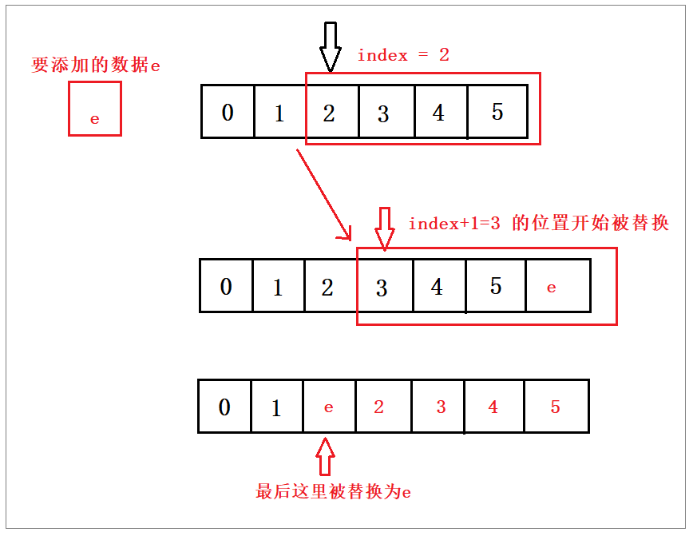

# 二、 ArrayList源码分析


## 一、 简介

ArrayList 是常用的存储容器之一， 其底层是用**数组**实现，可以存储任意类型的数据

ArrayList是**线程不安全**的。

非常适用与对元素的**查找**，效率非常高。


## 二、 线程安全性

对ArrayList的操作一般分为两个步骤，**改变位置(size)**和**操作元素(e)**。所以这个过程在**多线程**的环境下是不能保证

具有**原子性**的，因此ArrayList在多线程的环境下是线程不安全的。


## 三、 源码分析

### 1. 属性分析

```java
/**
 * 默认初始化容量
 */
private static final int DEFAULT_CAPACITY = 10;

/**
 * 如果自定义容量为0，则会默认用它来初始化ArrayList。或者用于空数组替换。
 */
private static final Object[] EMPTY_ELEMENTDATA = {};

/**
 * 如果没有自定义容量，则会使用它来初始化ArrayList。或者用于空数组比对。
 */
private static final Object[] DEFAULTCAPACITY_EMPTY_ELEMENTDATA = {};

/**
 * 这就是ArrayList底层用到的数组

 * 非私有，以简化嵌套类访问
 * transient 在已经实现序列化的类中，不允许某变量序列化
 */
transient Object[] elementData;

/**
 * 实际ArrayList集合大小
 */
private int size;

/**
 * 可分配的最大容量
 */
private static final int MAX_ARRAY_SIZE = Integer.MAX_VALUE - 8;
```


#### 扩展：什么是序列化

> 序列化：是指将对象转换成以**字节序列**的形式来表示，以便用于持久化和传输。
>
> 实现方法：实现**Seralizable**接口
>
> 然后用的时候拿出来进行反序列化即可又变成Java对象


#### transient 关键字解析

> Java中transient关键字的作用，简单地说，就是**让某些被修饰的成员属性变量不被序列化**。

有了`transient`关键字声明，则**这个变量不会参与序列化操作**，即使所在类实现了Serializable接口，反序列化后

该变量为空值。

> 那么问题来了：ArrayList中数组声明：**`transient Object[] elementData;**`，事实上我们使用ArrayList在
>
> 网络传输用的很正常，并没有出现空值。

原来：`ArrayList`在序列化的时候会调用**`writeObject()`**方法，将**`size`**和**`element`**写入

**`ObjectOutputStream`**；反序列化时调用**`readObject()`**，从**`ObjectInputStream`**获取**`size`**和**`element`**，再

恢复到**`elementData`**。

> 那为什么不直接用**elementData**来序列化，而采用上诉的方式来实现序列化呢？

原因在于`elementData`是一个**缓存数组**，它通常会**预留一些容量**，等**容量不足**时再**扩充容量**，那么有些空间可能

就没有实际存储元素，采用上诉的方式来实现序列化时，就可以保证**只序列化实际存储的那些元素**，而不是整个数

组，从而**节省空间和时间**。


### 2. 构造方法分析

#### 2.1 无参构造函数

```java
public ArrayList() {
    // 数据初始化为空
    this.elementData = DEFAULTCAPACITY_EMPTY_ELEMENTDATA;
}
```


#### 2.2 指定容量的构造函数

```java
public ArrayList(int initialCapacity) { // 指定初始化的容量
    if (initialCapacity > 0) {
        // 创建指定容量的数组
        this.elementData = new Object[initialCapacity];
    } else if (initialCapacity == 0) {
        // 指定长度为0 ，空数组
        this.elementData = EMPTY_ELEMENTDATA;
    } else {
        // 容量非法，报错误
        throw new IllegalArgumentException("Illegal Capacity: "+
                                           initialCapacity);
    }
}
```


#### 2.3 集合做参数进行初始化(集合为空，初始化为空数组)

```java
/**
 * 通过集合做参数的形式初始化
 */
public ArrayList(Collection<? extends E> c) {
    elementData = c.toArray();
    if ((size = elementData.length) != 0) {
        // c.toArray might (incorrectly) not return Object[] (see 6260652)
        if (elementData.getClass() != Object[].class)
            elementData = Arrays.copyOf(elementData, size, Object[].class);
    } else {
        // replace with empty array.
        this.elementData = EMPTY_ELEMENTDATA;
    }
}
```


### 3. 添加数据

#### 3.1 直接添加数据（ArrayList为数组结构，默认在数组末尾添加）

<br>

**步骤**：

> - 检查是否需要扩容(***参数为 size+1***)
> - 插入元素

**代码**：

```java
public boolean add(E e) {
    // 是否需要扩容
    ensureCapacityInternal(size + 1);  // Increments modCount!!
    // 元素赋值
    elementData[size++] = e;
    return true;
}
```

扩容函数在下面讲解。


#### 3.2 在指定位置添加数据(指定下标)

**步骤**：

> - 判断下标是否越界
> - 检查是否需要扩容
> - 将index后的元素全部后移一位
> - 将index的位置赋予新的值

**代码**：

```java
public void add(int index, E element) {
    // 判断index是否越界
    rangeCheckForAdd(index);

    // size 为数组的长度
    // 检查是否需要扩容
    ensureCapacityInternal(size + 1);  // Increments modCount!!
    
    // 将index后的元素后移一位
    System.arraycopy(elementData, index, elementData, index + 1,
                     size - index);
    // index位置赋予新值
    elementData[index] = element;
    size++;
}

```


**异常处理（下标越界）**

```java
private void rangeCheckForAdd(int index) {
    if (index > size || index < 0)
        throw new IndexOutOfBoundsException(outOfBoundsMsg(index));
}
```

<br>

#### 3.3 扩容方法：


**扩容入口方法**

```java
// minCapacity:size+1(即：实际ArrayList的大小 + 1，每次添加前都要判断+1大小是否需要扩容)
private void ensureCapacityInternal(int minCapacity) {//判断扩容前先判断是否为空数组
    if (elementData == DEFAULTCAPACITY_EMPTY_ELEMENTDATA) {
	// 判断为空数组，则默认大小为 DEFAULT_CAPACITY（默认容量为10.）
        minCapacity = Math.max(DEFAULT_CAPACITY, minCapacity);
    }
    
	//判断是否需要扩容
    ensureExplicitCapacity(minCapacity);
}
```


**判断是否需要扩容**

```java
private void ensureExplicitCapacity(int minCapacity) {
    modCount++;	//计算修改次数

    // overflow-conscious code
    //如果要的最小容量 > 数组实际长度，则进行扩容
    //比如：插入第11个元素时，minCapacity = size + 1 (即10+1)，数组长度为 10 ，那么此时要扩容
    if (minCapacity - elementData.length > 0)
        //扩容的具体方法
        grow(minCapacity);
}
```


**库容的具体方法**

```java
private void grow(int minCapacity) {
    // overflow-conscious code
    // 当前数组的长度
    int oldCapacity = elementData.length; 
    // 新的数组容量 = 老容量 + (老容量 / 2)  (1.5 倍)
    // oldCapacity = 10,   oldCapacity >> 1
    //  0000  1010  >>  1,  0000  0101 = 5
    int newCapacity = oldCapacity + (oldCapacity >> 1);

    // 已扩容的容量与想要的最小数组容量比较
    if (newCapacity - minCapacity < 0)
        newCapacity = minCapacity;	
    // 判断数组容量是否超出系统的最大容量
    if (newCapacity - MAX_ARRAY_SIZE > 0)
        newCapacity = hugeCapacity(minCapacity);
    // minCapacity is usually close to size, so this is a win:
    elementData = Arrays.copyOf(elementData, newCapacity);
}

```


#### 系统只能提供最大的容量

```java
// 判断当前容量与系统容量
private static int hugeCapacity(int minCapacity) {
    if (minCapacity < 0) // overflow
        throw new OutOfMemoryError();
    //超过最大容量，也只能赋值为最大的容量，如法再大
    return (minCapacity > MAX_ARRAY_SIZE) ?
        Integer.MAX_VALUE :
        MAX_ARRAY_SIZE;
}
```


#### Arrays.copyOf方法

```java
public static void arraycopy(Object src, int srcPos, Object dest, int destPos, int length)

```


**代码解释:**<br>

- Object src : 原数组
- int srcPos : 从元数据的起始位置开始
- Object dest : 目标数组
- int destPos : 目标数组的开始起始位置
- int length : 要copy的数组的长度

原理简单讲就是，**index之后的位置**替换为 **index及index后的元素**


**图示：**




#### 为啥要 size+1

> 上面提到的，检查是否要扩容的时候，参数是 **`size+1`**，而不是size。
>
> size + 1 的含义是：如果集合添加数据成功，数组实际的元素个数。 为了确保扩容不会出错。
>
> 
>
> 假如默认**size = 0**, 那么扩容时， 0 + 0 >> 1(右移一位)结果是0.等于没扩容
>
> 为什么默认容量是10，还会有size= 0 的情况。是因为在**jdk1.8之后**，扩容方法是放在**add()**之中，之前是放在**构造方法**中。1.8版本中，默认 **`ArrayList list = new ArrayList();`** 后，size是0，size + 1对扩容有必要。size 只会在 add()方法被调用时才会自增。


```java
public static void main(String[] args) {
    ArrayList arrayList = new ArrayList();
    System.out.println(arrayList.size());
}

输出:0
```

**（不一定能证明容量就是0）**


### 4. 删除元素

#### 4.1 指定位置删除元素

**思路**：

将要删除元素位置后面的元素**前移**，最后的元素置为空，**让GC回收(下面英文注释)**。**（size - index - 1）**

```java
public E remove(int index) {
    // 判断下标是否越界
    rangeCheck(index);

    modCount++;//修改次数
    // 得到要删除的元素的值
    E oldValue = elementData(index);
    
    // 要删除的元素的后面元素个数
    int numMoved = size - index - 1;
    if (numMoved > 0)
        // 将指定位置的后面元素全部向前移动
        System.arraycopy(elementData, index+1, elementData, index,
                         numMoved);
    // 最后一位置为空
    elementData[--size] = null; // clear to let GC do its work

    // 返回删除的值
    return oldValue;
}

```


#### 4.2 指定元素删除

```java
public boolean remove(Object o) {
    if (o == null) { // 判断值是否为null
        for (int index = 0; index < size; index++)
            if (elementData[index] == null) {
                fastRemove(index); // 为空，直接将该位置的元素删除
                return true;
            }
    } else {
        for (int index = 0; index < size; index++)
            if (o.equals(elementData[index])) { // 匹配到值，直接删除
                fastRemove(index);
                return true;
            }
    }
    return false;
}

```

**fastRemove() 方法**

```java
private void fastRemove(int index) {
    modCount++;
    int numMoved = size - index - 1;
    if (numMoved > 0)
        System.arraycopy(elementData, index+1, elementData, index,
                         numMoved);
    elementData[--size] = null; // clear to let GC do its work
}
```


#### 4.3 遍历删除

```java
public static void main(String[] args) {
    ArrayList<Integer> list = new ArrayList();
    list.add(1);
    list.add(2);
    list.add(3);
    list.add(4);
    list.add(5);

    for(Integer num: list){
        if(num == 3){
            list.remove(num);
        }
    }
    
}
【用上面的方法遍历删除，会报错】
// 报错
/* Exception in thread "main" java.util.ConcurrentModificationException at java.util.ArrayList$Itr.checkForComodification(ArrayList.java:901)
	at java.util.ArrayList$Itr.next(ArrayList.java:851)
	at Collection.main(Collection.java:21)
*/

原因：
final void checkForComodification() {
    if (modCount != expectedModCount)
        throw new ConcurrentModificationException();
}

```


**解决：使用迭代器的删除方法，不要使用list的删除方法**

```java
Iterator<Integer> it = list.iterator();
while (it.hasNext()){
    Integer num = it.next();
    if(num == 3){
        // 使用迭代器的删除方法
        it.remove();
        //list.remove(num);//这样依然会报错
    }
}

public void remove() {
    if (lastRet < 0)
        throw new IllegalStateException();
    checkForComodification();

    try {
        ArrayList.this.remove(lastRet);
        cursor = lastRet;
        lastRet = -1;
        // 修改expectedModCount = modCount;
        expectedModCount = modCount;
    } catch (IndexOutOfBoundsException ex) {
        throw new ConcurrentModificationException();
    }
}

```


### 5. 查找元素

#### 5.1 返回指定下标的元素

```java
public E get(int index) {
    rangeCheck(index);

    return elementData(index);
}
```


### 6. 替换指定下标的元素

```java
public E set(int index, E element) {
    rangeCheck(index);

    E oldValue = elementData(index);
    elementData[index] = element;
    return oldValue; //返回旧值
}

E elementData(int index) {
    return (E) elementData[index];
}
```


### 7. 获取Object对象获取数组的索引值

```java
public int indexOf(Object o) {
    if (o == null) {
        for (int i = 0; i < size; i++)
            if (elementData[i]==null)
                return i;
    } else {
        for (int i = 0; i < size; i++)
            if (o.equals(elementData[i]))
                return i;
    }
    return -1;
}
```


如果o为空，则返回数组中**第一个为空的索引**；不为空也类似。

通过源码可以看到，该方法是允许传空值进来的。


### 8. 其他主干方法

#### 8.1 trimToSize()


> 用来最小化实例存储，将容器大小调整为当前元素所占用的容量大小。


```java
/**
 * 这个方法用来最小化实例存储。
 */
public void trimToSize() {
    modCount++;
    if (size < elementData.length) {
        elementData = (size == 0)
          ? EMPTY_ELEMENTDATA
          : Arrays.copyOf(elementData, size);
    }
}
```


#### 8.2 clone()方法


> 用来克隆出一个新数组。


```java
public Object clone() {
    try {
        ArrayList<?> v = (ArrayList<?>) super.clone();
        v.elementData = Arrays.copyOf(elementData, size);
        v.modCount = 0;
        return v;
    } catch (CloneNotSupportedException e) {
        // this shouldn't happen, since we are Cloneable
        throw new InternalError(e);
    }
}
```


### 9. ArrayList优缺点

**优点：**

- 因为其底层是数组，所以修改和查询效率高。
- 可自动扩容(1.5倍)。

**缺点：**

- 插入和删除效率不高。
- 线程不安全。


### 10. 手写ArrayList

```java
public class MyArrayList {

    // 非私有，以简化嵌套类访问
    // transient 在已经实现序列化的类中，不允许某变量序列化
    transient Object[] elementData;

    //默认容量
    private static final int DEFAULT_CAPACITY = 10;

    // 用于空实例的 空数组实例
    private static final Object[] EMPTY_ELEMENTDATA = {};

    private static final Object[] DEFAULTCAPACITY_EMPTY_ELEMENTDATA = {};
    // 实际ArrayList集合大小
    private int size;
    /**
     * 构造方法
     */
    public MyArrayList(int initialCapacity) {
        if (initialCapacity > 0) {
            this.elementData = new Object[initialCapacity];
        } else if (initialCapacity == 0) {
            this.elementData = EMPTY_ELEMENTDATA;
        } else {
            throw new IllegalArgumentException("Illegal Capacity: "+
                    initialCapacity);
        }
    }
    public MyArrayList(){
        this(DEFAULT_CAPACITY);
    }

    public void add(Object o){
        //1. 判断数据容量是否大于 elementData
        ensureExplicitCapacity(size+1);
        //2. 使用下标进行赋值
        elementData[size++] = o;
    }
    private void ensureExplicitCapacity(int minCapacity){
        if (size == elementData.length){
            // 需要扩容,扩容1.5倍(ArrayList默认扩容1.5倍)
            // 注意：如果oldCapacity值为1
            int oldCapacity = elementData.length;
            int newCapacity = oldCapacity + (oldCapacity >> 1);
            // 如果新容量 < 最小容量， 则将最小容量赋值给新容量
            // 如果 oldCapacity=1, 则 minCapacity=1+1=2   newCapacity=1+(1>>1)=1
            if (newCapacity - minCapacity < 0){
                newCapacity = minCapacity;
            }
            // 创建新数组
            Object[] objects = new Object[newCapacity];
            // 将数据复制给新数组
            System.arraycopy(elementData, 0, objects, 0, elementData.length);
            // 修改引用
            elementData = objects;
        }
    }
    public Object get(int index) {
        rangeCheck(index);
        return elementData[index];
    }
    private void rangeCheck(int index) {
        if (index >= size)
            throw new IndexOutOfBoundsException("下标越界");
    }

    /**
     * 通过下标删除
     * @param index
     * @return
     */
    public Object remove(int index) {
        rangeCheck(index);

//        modCount++;
        // 先查出元素
        Object oldValue = elementData[index];
        // 找出置换结束位置
        int numMoved = size - index - 1;
        if (numMoved > 0)
            // 从 index+1 开始 将值覆盖为 index-numMoved 的值
            System.arraycopy(elementData, index+1, elementData, index, numMoved);
        elementData[--size] = null; // clear to let GC do its work

        return oldValue;
    }
    public boolean remove(Object o) {
            for (int index = 0; index < size; index++){
                if (o.equals(elementData[index])) {
                    remove(index);
                    return true;
                }
            }
        return false;
    }
}
```

手写代码来源：[面试必会之ArrayList源码分析&手写ArrayList](<https://mp.weixin.qq.com/s?__biz=MzI4Njc5NjM1NQ==&mid=2247487595&idx=1&sn=66ddcba9714ab9c38d76db14f5c22558&chksm=ebd62f47dca1a651a2eca99cb583c02ae8d6dadf50623d27122aea7761e058d8dc5b2e5cacc6&scene=21#wechat_redirect>)


## 参考

[List集合就这么简单](<https://mp.weixin.qq.com/s?__biz=MzI4Njg5MDA5NA==&mid=2247484130&idx=1&sn=4052ac3c1db8f9b33ec977b9baba2308&chksm=ebd743e3dca0caf51b170fd4285345c9d992a5a56afc28f2f45076f5a820ad7ec08c260e7d39#rd>)

[面试必会之ArrayList源码分析&手写ArrayList](<https://mp.weixin.qq.com/s?__biz=MzI4Njc5NjM1NQ==&mid=2247487595&idx=1&sn=66ddcba9714ab9c38d76db14f5c22558&chksm=ebd62f47dca1a651a2eca99cb583c02ae8d6dadf50623d27122aea7761e058d8dc5b2e5cacc6&scene=21#wechat_redirect>)


