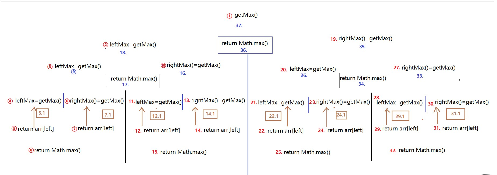

# 二、 排序分类和递归


## 排序分类


排序大的分类可以分为两种：**内排序和外排序。**

在排序过程中，全部记录存放在**内存**，则称为**内排序**，如果排序过程中需要使用**外存**，则称为**外排序**。

 <br>


内排序有可以分为以下几类：

  **(1)、插入排序：直接插入排序、二分法插入排序、希尔排序。**

  **(2)、选择排序：直接选择排序、堆排序。**

  **(3)、交换排序：冒泡排序、快速排序。**

  **(4)、归并排序**

  **(5)、基数排序**

<br>


****

## 递归

剖析递归行为和递归行为时间复杂度的估算一个递归行为的例子

**master公式的使用**

**T(N) = a\*T(N/b) + O(N^d)**

**1) log(b,a) > d   ------   复杂度为O(N^log(b,a))**

**2) log(b,a) = d   ------   复杂度为O(N^d \* logN)**

**3) log(b,a) < d   ------   复杂度为O(N^d)**

补充阅读：[算法的复杂度与 Master 定理](https://blog.gocalf.com/algorithm-complexity-and-master-theorem)

 <br>


### 用递归求数组的最大值

**思路**：

分别**左递归和右递归，**求出前一半数组和后一半数组的最大值比较，较大的为整个数组最大值

< br>


- **递归实际上在栈中的表现为：**

- **当调用自己时，就压栈，把所执行到的行号以及相关的所有信息都压入栈内。**

- **当return时，判断下一步该如何执行程序，就看栈顶是哪个函数，出栈，执行，直到执行完毕。**

<br>

**代码**：

```java
package sort;
/**
 * @program: Multi_002
 * @description: 递归算法求数组的最大值
 * @author: wenyan
 * @create: 2019-10-13 15:20
 **/

public class Recursion {
    public static int getMax(int arr[], int left, int right){
        if(left == right){ // 左右相等，不用比较。
            return arr[left];   //arr[left] 此时是等于 arr[right]。
        }
        int mid = (left + right) / 2;
        int leftMax = getMax(arr, left, mid);
        int rightMax = getMax(arr, mid+1, right);
        //输出方便理解递归
        System.out.println("leftMax:" + leftMax + "-----" + rightMax + ":rightMax");
        return Math.max(leftMax, rightMax);
    }

    public static void main(String[] args) {
        int arr[] = {4 , 3 , 9 , 1 , 7 , 2 , 8 , 0};
        int max = getMax(arr, 0, arr.length-1);
        System.out.println("数组最大值为:" + max);
    }
}
```

<br>

**结果：**

```java
leftMax:4-----3:rightMax
leftMax:9-----1:rightMax
leftMax:4-----9:rightMax
leftMax:7-----2:rightMax
leftMax:8-----0:rightMax
leftMax:7-----8:rightMax
leftMax:9-----8:rightMax
数组最大值为:9
```


<br>

**解析：**

1. 执行某一行，比如 **`int leftMax = getMax(arr, left, mid);`** ， 当执行到这一行时，会记录所有的信息，包括当前行号，arr，left， mid 等信息 全部压到栈中。
2. 继续调用 **`getMax()`** 函数， 直到终止条件 **`left == right`** , 返回。
3. 返回过程是：从栈中弹出 **栈顶** 信息，返回原来一行所需要的值。比如还是这行， **`int leftMax = getMax(arr, left, mid);`**  用新变量 **`leftMax`** 接住返回值。
4. 返回一行之后，接着向下执行，**`int rightMax = getMax(arr, mid+1, right);`**， 同理。
5. 接着执行 **`Math.max(leftMax, rigthMax);`**。 返回（从栈中弹出）
6. 具体，看下面的图。

<br>


其中 **5.1、 7.1 、 12.1、 14.1 、22.1、 24.1、 29.1、 31.1**

这些是**前期画图缺少的步骤，后面补上去的。**




<br>

<br>


