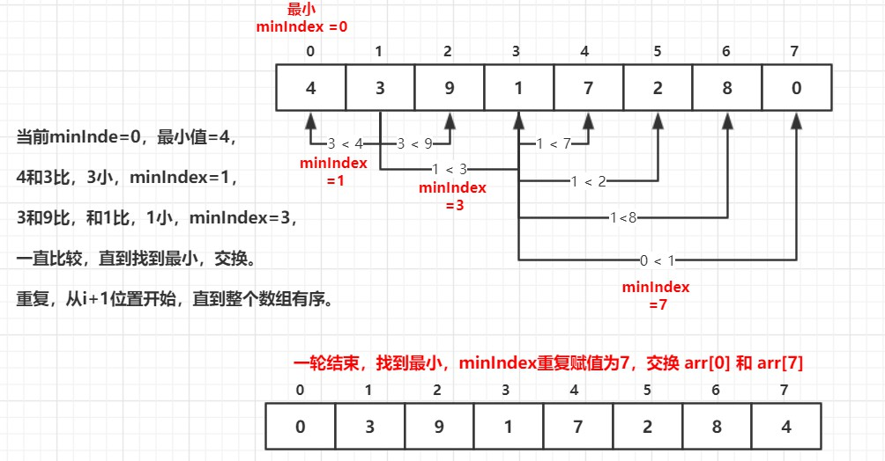

# 五、 选择排序

## 选择排序


第一次从待排序的数据元素中选出**最小**（或最大）的一个元素，存放在序列的起始位置，

然后再从剩余的未排序元素中寻找到**最小**（大）元素，然后放到**已排序的序列的末尾。**

以此类推，直到全部待排序的数据元素的个数为零。

**稳定性：不稳定。**

<br>


**对数组排序**：

**思路**：



<br>


代码**：

```java
package sort;

/**
 * @program: Multi_002
 * @description: 选择排序
 * @author: wenyan
 * @create: 2019-10-14 00:43
 **/
public class SelectionSort {
    public static void selectionSort(int[] arr){
        if(arr == null || arr.length < 2){
            return;
        }
        for(int i = 0; i<arr.length - 1; i++){
            int minIndex = i;   //每一轮比较最小数的下标
            for(int j = i+1; j<arr.length; j++){
                minIndex = arr[j] < arr[minIndex] ? j : minIndex;
            }
            if(minIndex != i){
               swap(arr, minIndex, i);
            }
        }
    }
    public static void swap(int[] arr, int i, int j) {
        int tmp = arr[i];
        arr[i] = arr[j];
        arr[j] = tmp;
    }
    //输出数组
    public static void printArray(int[] arr){
        if(arr == null){
            return;
        }
        for(int i = 0; i<arr.length; i++){
            System.out.print(arr[i] + "  ");
        }
        System.out.println();
    }
    public static void main(String[] args) {
        int arr[] = {4 , 3 , 9 , 1 , 7 , 2 , 8 , 0};
        selectionSort(arr);
        printArray(arr);
    }
}

```

<br>

**结果**：

```java
0  1  2  3  4  7  8  9  
```

<br>


