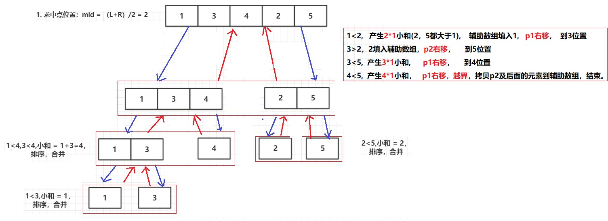
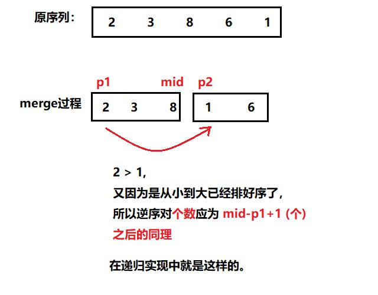

# 七、 归并排序应用：小和问题 和 逆序对问题


## 一、 小和问题

在一个数组中，每一个数左边比当前数小的数累加起来，叫做这个数组的小和。求一个数组的小和。

例子：

**[1,3,4,2,5]**

1左边比1小的数，没有；

3左边比3小的数，1；

4左边比4小的数，1、3；

2左边比2小的数，1；

5左边比5小的数，1、3、4、2；

所以小和为1+1+3+1+1+3+4+2=16

<br>

**思路**：

在上一篇文章：[《归并排序》](归并排序.md)中讲了递归实现归并排序，可以用在小和问题上。

**就是在归并排序的过程中，比较左右指针所在位置的大小，并加总小和。**



<br>

**代码**：

```java
package sort;

/**
 * @program: Multi_002
 * @description: 归并排序的小和问题
 * @author: wenyan
 * @create: 2019-10-14 15:40
 **/
public class SmallSum {
    public static int smallSum(int arr[]){
        if(arr == null || arr.length<2){
            return 0;
        }
        return mergeSort(arr, 0, arr.length-1);
    }

    private static int mergeSort(int[] arr, int L, int R) {
        if(L == R){
            return 0;
        }
        int mid = L + ((R - L)/2);
        return mergeSort(arr, L, mid)   //左边排好序的小和 + 右边排好序的小和 + 最后合并的小和。
              +mergeSort(arr, mid+1, R)
              +merge(arr, L, mid, R);

    }

    private static int merge(int[] arr, int L, int mid, int R) {
        int i = 0;
        int p1 = L;
        int p2 = mid + 1;
        int help[] = new int[R-L+1];
        int res = 0;    //记录小和。
        while (p1<=mid && p2<=R){
            res += arr[p1] < arr[p2] ? arr[p1]*(R-p2+1) : 0;
            help[i++] = arr[p1] < arr[p2] ? arr[p1++] : arr[p2++];
        }
        while (p1<=mid){
            help[i++] = arr[p1++];
        }
        while (p2<=R){
            help[i++] = arr[p2++];
        }
        for(i = 0; i<help.length; i++){
            arr[L+i] = help[i];
        }
        return res; //返回小和。
    }
    //输出数组
    public static void printArray(int[] arr){
        if(arr == null){
            return;
        }
        for(int i = 0; i<arr.length; i++){
            System.out.print(arr[i] + "  ");
        }
        System.out.println();
    }
    public static void main(String[] args) {
        int arr[] = {1, 3, 4, 2, 5};
        System.out.println("原序列为：");
        printArray(arr);
        System.out.println("小和为：" + smallSum(arr));
    }
}

```

<br>

**结果**：

```java
原序列为：
1  3  4  2  5  
小和为：16
```

<br>


## 二、 逆序对问题

设 A 为一个有 n 个数字的**有序集(n>1)**，其中所有数字各不相同。

如果存在正整数 i, j 使得 **`1 ≤ i < j ≤ n`** 而且 **`A[i] > A[j]`**，则 **`<A[i], A[j]>`** 这个**有序对**称为 **A 的一个逆序对**，也称作**逆序数。**

例如：数组 **<2,3,8,6,1>** 的逆序对为：**<2,1> <3,1> <8,1> <8,6> <6,1>** 共5个逆序对。


<br>

问题：

数组**<2,3,8,6,1>** 求它的**逆序对** 和 **逆序对的个数。**

<br>

**思路：**

延续小和问题，在merge过程中， 当p1位置大于p2位置时， 逆序对个数应该是 ： **mid-p1+1** 个

具体见下图。



<br>

**代码**：

```java
package sort;

/**
 * @program: Multi_002
 * @description: 归并排序的逆序对问题
 * @author: wenyan
 * @create: 2019-10-14 16:37
 **/


public class Inserve {
    public static int inserve(int arr[]){
        if(arr == null || arr.length<2){
            return 0;
        }
        return mergeSor(arr, 0, arr.length-1);
    }

    private static int mergeSor(int[] arr, int L, int R) {
        if(L == R){
            return 0;
        }
        int mid = L + ((R - L)>>1);
        return mergeSor(arr, L, mid)
             + mergeSor(arr, mid+1, R)
             + merge(arr, L, mid, R);

    }

    private static int merge(int[] arr, int L, int mid, int R) {
        int i = 0;
        int p1 = L;
        int p2 = mid + 1;
        int[] help = new int[R-L+1];
        int res = 0;    //逆序对个数
        while (p1<=mid && p2<=R){
            if(arr[p1] > arr[p2]){ // arr[p1] < arr[p2], 逆序对才成立。
                res += mid - p1 + 1;
                for(int j = p1; j<=mid; j++){
                    //从p1开始到mid，分别和对应的 arr[p2] 组成逆序对。打印
                    System.out.println("逆序对为：<" + arr[j] + "," + arr[p2] + ">");
                }
            }
            help[i++] = arr[p1] < arr[p2] ? arr[p1++] : arr[p2++];
        }
        while (p1<=mid){
            help[i++] = arr[p1++];
        }
        while (p2<=R){
            help[i++] = arr[p2++];
        }
        //拷贝回原数组
        for(i = 0; i<help.length; i++){
            arr[L + i] = help[i];
        }
        return res;
    }

    public static void main(String[] args) {
        int arr[] = {2, 3, 8, 6, 1};
        System.out.println("逆序对的个数为:" + inserve(arr));
    }
}
```

<br>

**结果：**

```java
逆序对为：<6,1>
逆序对为：<2,1>
逆序对为：<3,1>
逆序对为：<8,1>
逆序对为：<8,6>
逆序对的个数为:5
```

<br>


