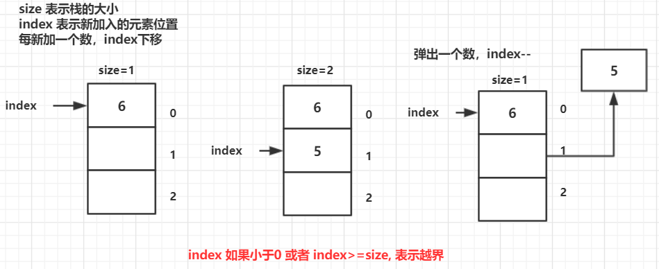
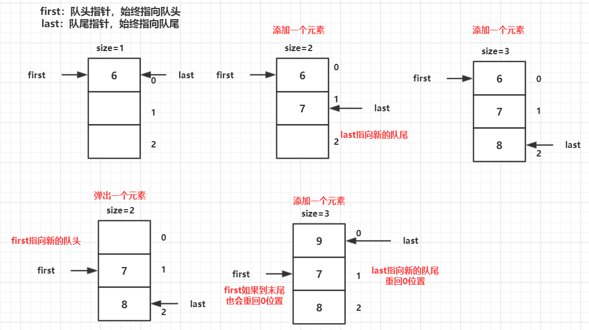
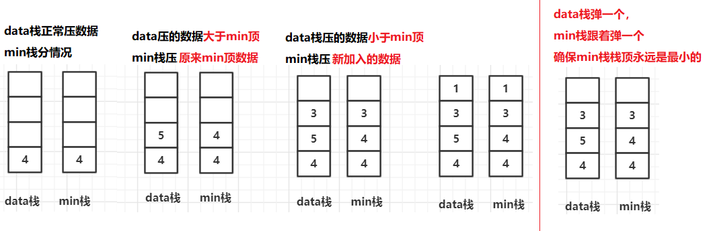
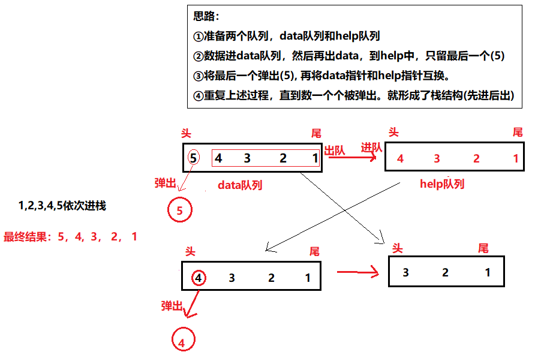
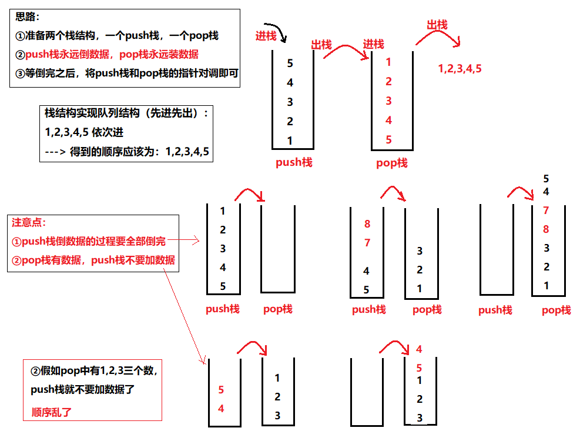

# 一、 栈和队列


# 一、 数组结构实现大小固定的队列和栈

## 1. 数组实现栈


**图示思路**：



<br>


**代码**：

```java
package datastructure;

/**
 * @program: Multi_002
 * @description: 数组转换为栈
 * @author: wenyan
 * @create: 2019-10-16 15:51
 **/

public class ArrayToStack {
    public static class ArrayStack{
        private Integer[] arr;
        private Integer size;
        public ArrayStack(int initSize){
            if(initSize < 0){
                throw new IllegalArgumentException("栈初始化大小不能小于0");
            }
            arr = new Integer[initSize];
            size = 0;
        }
        public Integer peek(){  //弹出栈顶，但是不移除栈顶元素
            if(size == 0){
                return null;
            }
            return arr[size - 1];
        }
        public void push(int obj){  //添加元素
            if(size == arr.length){
                throw new IllegalArgumentException("栈已满");
            }
            arr[size] = obj;
            size++;
        }
        public Integer pop(){   //弹出栈顶元素，但是会移除栈顶元素
            if(size == 0){
                throw new IllegalArgumentException("栈已空");
            }
            return arr[size--];
        }
    }

    public static void main(String[] args) {
    }
}
```

<br>


## 2. 数组实现队列



<br>


**代码**:

```java
package datastructure;

/**
 * @program: Multi_002
 * @description: 数组转换为队列
 * @author: wenyan
 * @create: 2019-10-16 16:09
 **/


public class ArrayToQueue {
    public static class ArrayQueue{
        private Integer [] arr;
        private Integer size;
        private Integer first;  //始终指向队头的指针
        private Integer last;   //始终指向队尾的指针

        public ArrayQueue(int initSize){
            if(initSize < 0){
                throw new IllegalArgumentException("队列初始化长度不能小于0");
            }
            arr = new Integer[initSize];
            this.size = 0;
            this.first = 0;
            this.last = 0;
        }
        public Integer peek(){
            if(size == 0){
                return null;
            }
            return arr[first];
        }
        public void push(int obj){
            if(size == arr.length){
                throw new IllegalArgumentException("队列已满");
            }
            size++;
            arr[last] = obj;
            //队尾指针是否到了限定大小位置，如果是，加1越界，需要重新定位到0位置，否则，last加1.
            last = (last==arr.length-1) ? 0 : (last+1);
        }
        public Integer poll(){
            if(size == 0){
                throw new IllegalArgumentException("队列为空");
            }
            size--;
            int tmp = arr[first];   //tmp存储要弹出的队头的元素
            //如果队头指针(first)到了末尾，那么回到0位置，否则加1.
            first = first==arr.length-1 ? 0 : first+1;
            return tmp;
        }
    }

    public static void main(String[] args) {
    }
}

```


## 3. 栈有关的问题

**【题目】**

实现一个特殊的栈，在实现栈的基本功能的基础上，再实现返回栈中最小元素的操作。

**【要求】**

- pop、push、getMin  操作的 时间复杂度都是 **O(1)。**
- 设计的栈类型可以使用现成的栈结构。

<br>


**思路：**



<br>

**代码**：

```java
package datastructure;

import java.util.Stack;

/**
 * @program: Multi_002
 * @description: 双栈求最小数
 * @author: wenyan
 * @create: 2019-10-16 17:25
 **/


public class GetMinStack {
    public static class MyStack{
        private Stack<Integer> stackData;
        private Stack<Integer> stackMin;

        public MyStack(){
            this.stackData = new Stack<Integer>();
            this.stackMin = new Stack<Integer>();
        }

        public void push(int newNum){
            if(stackMin.isEmpty()){ //min栈为空，直接加入
                this.stackMin.push(newNum);
            }else if(newNum < stackMin.peek()){ //新加的数小于min栈栈顶元素。
                this.stackMin.push(newNum);
            }else{
                this.stackMin.push(this.stackMin.peek());//否则，新加的比min栈栈顶大，min栈压原来栈顶元素
            }
            this.stackData.push(newNum);
        }
        public int pop(){
            if(this.stackData.isEmpty()){
                throw new IllegalArgumentException("栈为空");
            }
            //min栈弹一个
            this.stackMin.pop();
            //data栈弹一个并返回
            return this.stackData.pop();
        }
        //得到data栈顶最小值(其实就是得到min栈的栈顶元素)
        public int getMin(){
            if(this.stackMin.isEmpty()){
                throw new IllegalArgumentException("栈为空");
            }
            return this.stackMin.peek();
        }
    }

    public static void main(String[] args) {
        MyStack stack = new MyStack();
        stack.push(3);
        System.out.println(stack.getMin());
        stack.push(4);
        System.out.println(stack.getMin());
        stack.push(1);
        System.out.println(stack.getMin());
        System.out.println(stack.pop());
        System.out.println(stack.getMin());
    }
}

```

<br>

**结果**：

````java
3
3
1
1
3
````

<br>


## 二、 栈和队列相互实现

### 1. 仅用队列结构实现栈结构

**思路：**



<br>

**代码**：

```java
package datastructure;

import java.util.LinkedList;
import java.util.Queue;
import java.util.Stack;

/**
 * @program: Multi_002
 * @description: 仅用队列实现栈结构
 * @author: wenyan
 * @create: 2019-10-16 20:16
 **/


public class QueueToStack {
    private Queue<Integer> data;
    private Queue<Integer> help;
    public QueueToStack() {
        this.data = new LinkedList<Integer>();
        this.help = new LinkedList<Integer>();
    }
    public void push(int num){
        data.add(num);
    }
    public int pop(){
        if(data.isEmpty()){
            throw new IllegalArgumentException("栈为空");
        }
        while (data.size() > 1){//只剩最后一个进队的元素。
            help.add(data.poll());  // data --> help
        }
        int res = data.poll();
        swap();      //交换data和help的指针。
        return res;
    }
    public int peek(){
        if(data.isEmpty()){
            throw new IllegalArgumentException("栈为空");
        }
        while (data.size() != 1){
            help.add(data.poll());
        }
        int res = data.poll();
        help.add(res);  //加回help中，peek() 方法是不移除元素的。
        swap();
        return res;
    }
    //交换两个队列引用
    private void swap() {
        Queue<Integer> tmp = help;
        help = data;
        data = tmp;
    }
}

```


### 2. 仅用栈结构实现队列结构



<br>

**代码**：

```java
package datastructure;

import java.util.Stack;

/**
 * @program: Multi_002
 * @description: 仅用栈结构实现队列结构
 * @author: wenyan
 * @create: 2019-10-16 20:16
 **/


public class StackToQueue {
    private Stack<Integer> stackPush;
    private Stack<Integer> stackPop;
    public StackToQueue(){
        this.stackPush = new Stack<Integer>();
        this.stackPop = new Stack<Integer>();
    }
    public void push(int num){
        stackPush.push(num);
    }
    public int poll(){
        if(stackPush.empty() && stackPop.empty()){  //左右栈都为空
            throw new IllegalArgumentException("队列为空");
        }else if(stackPop.empty()){ //进队列为空
            while (!stackPush.empty()){
                stackPop.push(stackPush.pop());
            }
        }
        return stackPop.pop();  //弹出
    }
    public int peek(){
        if(stackPush.empty() && stackPop.empty()){
            throw new IllegalArgumentException("队列为空");
        }else if(stackPop.empty()){
            while (!stackPush.empty()){
                stackPop.push(stackPush.pop());
            }
        }
        return stackPop.peek();
    }

}

```


<br>


## 三、 猫狗队列问题


### 


